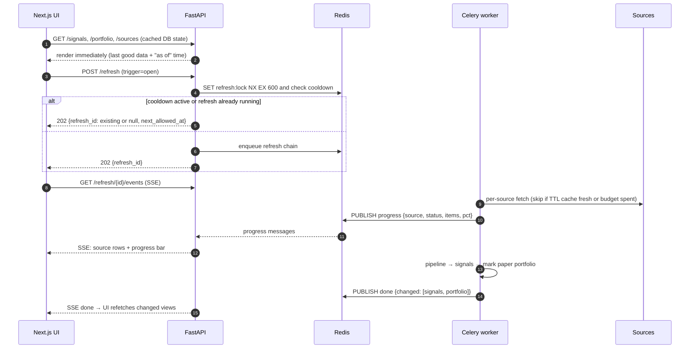
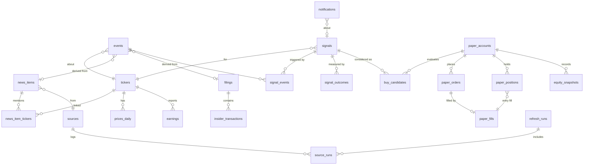

# CatalystEdge: Phase 0 Design

> **CatalystEdge** finds positive, news-driven swing-trade setups in US stocks and runs a
> $100 paper-trading account on them. Every signal starts from a fresh news item or filing.
> Technicals, fundamentals and models only confirm or rank it.
>
> **Status:** Phase 0 design complete; Phase 1 (MVP) in progress.
> **Not financial advice.** This is a research and paper-trading tool.

Contents
1. [Name choice](#1-name-choice)
2. [Architecture](#2-architecture)
3. [Data-source table (verified 2026-09-24)](#3-data-source-table)
4. [Tiingo: buy it or not?](#4-tiingo-buy-it-or-not)
5. [Which sources can be backtested](#5-which-sources-can-be-backtested)
6. [Database schema](#6-database-schema)
7. [File tree](#7-file-tree)
8. [How the hard rules are enforced](#8-how-the-hard-rules-are-enforced)
9. [Signal engine design](#9-signal-engine-design)
10. [Paper-trading engine design](#10-paper-trading-engine-design)
11. [Model choices](#11-model-choices)
12. [Phased plan and test gates](#12-phased-plan-and-test-gates)
13. [Monthly cost estimate](#13-monthly-cost-estimate)
14. [API keys you will need](#14-api-keys-you-will-need)
15. [Open questions for you](#15-open-questions-for-you)
16. [Roadmap (post-Phase 3)](#16-roadmap)

---

## 1. Name choice

**CatalystEdge.** Hard rule 1 says every signal begins with a catalyst, and the name says so.
It is used for the Python package (`catalystedge`), Docker service prefix (`catalystedge-*`),
database name, UI title, email sender name and all docs.

---

## 2. Architecture

### 2.1 Component diagram

```mermaid
flowchart LR
  subgraph External["External sources (read-only, rate-limited)"]
    direction TB
    N1[Finnhub news]:::news
    N2[Marketaux]:::news
    N3[Alpha Vantage News & Sentiment]:::news
    N4[Tiingo News<br/>flag, off]:::opt
    N5[Benzinga Basic API<br/>stub, off]:::opt
    N6[Investing.com RSS<br/>stub, off]:::opt
    E1[SEC EDGAR<br/>8-K, Form 4, 13F, companyfacts]:::ev
    E2[openFDA]:::ev
    E3[ClinicalTrials.gov v2]:::ev
    E4[Earnings calendar + history<br/>Finnhub / Alpha Vantage]:::ev
    E5[FRED macro]:::ev
    P1[Tiingo EOD<br/>free tier]:::px
    P2[Yahoo via yfinance<br/>FRAGILE]:::frag
    P3[Stooq CSV<br/>FRAGILE]:::frag
    P4[Alpha Vantage / Finnhub quotes]:::px
  end

  subgraph Backend["Backend (Python 3.12)"]
    direction TB
    AD[Adapter layer<br/>one file per provider<br/>rate limiter · TTL cache · backoff · circuit breaker]
    PL[News pipeline<br/>48h window → dedupe → ticker link → classify<br/>→ sentiment → mixed-headline rules → novelty/credibility]
    SE[Signal engine<br/>Stage 1 rules · Stage 2 LightGBM (Phase 2)<br/>calibration · sizing]
    PE[Paper engine<br/>next-open fills · exits on close · ledger]
    OT[Outcome tracker<br/>1/3/10-day results]
    BT[Backtester<br/>EDGAR + earnings, point-in-time]
    NT[Notifier<br/>Resend → SendGrid → SMTP]
    MR[Model registry<br/>FinBERT-family · LightGBM · optional Ollama]
  end

  subgraph Runtime["Runtime (Docker Compose)"]
    API[FastAPI api<br/>REST + SSE]
    WK[Celery worker]
    BEAT[Celery beat<br/>scheduler]
    PG[(Postgres 16)]
    RD[(Redis 7<br/>broker · cache · pub/sub · locks)]
    MV[(models volume)]
    WEB[Next.js web<br/>TS · Tailwind · shadcn/ui]
    OL[Ollama<br/>optional profile]:::opt
  end

  External --> AD
  BEAT -->|schedules| WK
  WK --> AD --> PL --> SE --> PE
  SE --> OT
  SE --> NT
  PE --> NT
  WK --> BT
  WK <--> PG
  WK <--> RD
  MR --- MV
  PL --- MR
  SE --- MR
  MR -.-> OL
  API <--> PG
  API <--> RD
  API -->|enqueue refresh| RD
  WEB -->|REST| API
  RD -->|progress pub/sub| API -->|SSE stream| WEB

  classDef news fill:#1e3a5f,stroke:#4a90d9,color:#fff
  classDef ev fill:#1f4d2e,stroke:#4caf50,color:#fff
  classDef px fill:#4a3b1a,stroke:#d4a017,color:#fff
  classDef frag fill:#5c1f1f,stroke:#e57373,color:#fff
  classDef opt fill:#333,stroke:#888,color:#ccc,stroke-dasharray: 4 3
```

### 2.2 On-open refresh (stale-while-revalidate)



A slow or failed source never blocks the others. Each source task has its own timeout and
circuit breaker, and the chain continues with whatever data arrived.

### 2.3 Scheduled jobs (run without the UI)

All times are US/Eastern and use the NYSE trading calendar (`exchange_calendars`).
Holidays and early closes are handled automatically.

| Job | When | What it does | Idempotency key |
|---|---|---|---|
| `news_poll` | every 5 min, 06:00–20:00 ET weekdays; every 30 min otherwise | fetch news adapters, run pipeline, drop items older than 48 h | `(source, provider_item_id)` unique |
| `events_poll` | every 10 min (EDGAR), hourly (openFDA, ClinicalTrials) | filings, Form 4, FDA actions, trial updates | accession no. / FDA application+action date / NCT id+version |
| `eod_prices` | 16:45 ET trading days, retry until 18:30 | EOD bars for universe + open positions + SPY | `(symbol, date)` PK |
| `eod_signals` | after `eod_prices` succeeds | rank signals as of today's close, run notifications | `(symbol, event_cluster, as_of_date)` |
| `paper_decide` | after `eod_signals` | exit checks on close; buy decisions; writes **orders for the next session** | `(account, symbol, side, decision_date)` |
| `paper_execute` | 09:35 ET trading days (after the official open print is available) | fill pending orders at that day's open ± costs | order id |
| `outcomes_update` | after `eod_prices` | fill 1/3/10-day outcomes for past signals | `(signal_id, horizon)` |
| `email_dispatch` | every 1 min | send queued notifications with retry/backoff | `dedupe_key` unique |
| `daily_digest` | 18:45 ET trading days (optional) | one summary email | `(date)` |
| `retention` | 03:00 ET daily | purge news older than 48 h from scoring tables (see 8.4) | n/a |

> Note on the 09:35 fill: the engine needs the day's official open price. It fetches the
> opening print from a quote endpoint (Finnhub `/quote` returns the day's open). If none
> is available, it waits for that day's EOD bar and fills at its `open`. Both use the open
> of the day after the decision, so there is no lookahead. See 10.2.

### 2.4 Deployment profiles

The same images and code run in both profiles. `CATALYSTEDGE_PROFILE` selects the wiring.
Full steps are in [DEPLOY_FREE.md](DEPLOY_FREE.md).

| | `local` (default) | `cloud` ($0 online) |
|---|---|---|
| UI | Next.js container | **Vercel Hobby** |
| API, worker, beat | containers on your PC | containers on an **Oracle Always Free** ARM VM behind Caddy (auto-TLS) |
| Postgres | container | **Neon Free** (short-lived connections so it can scale to zero) |
| Cache, budgets, cooldowns, SSE progress | local Redis | **Upstash Free** |
| Celery broker | local Redis | local Redis container on the VM (**not** Upstash, whose 500k commands/month would be used up by broker polling) |
| Backtest price archive | Parquet volume | Parquet volume on the VM disk (Neon's 0.5 GB can't hold it) |
| News poll cadence | 5 min | 15 min in market hours, hourly otherwise, to stay under Neon's 100 CU-h/month |
| Ollama | optional | off |

---

## 3. Data-source table

**How this was verified.** The sandbox this was built in **blocks direct HTTP access** to
most provider sites (finnhub.io, marketaux.com, alphavantage.co, tiingo.com all returned
`EGRESS_BLOCKED`). I verified through web search restricted to each provider's own domain
where possible, and via provider GitHub issues and docs otherwise. The **Verified via**
column shows the method for each row. Cells marked **⚠** could not be confirmed
from the provider's own page. Phase 1 includes `make verify-sources`, a script that calls
each API with your key and records the actual limits it sees (from response headers and
error bodies). That becomes the source of truth. It is available now as
`scripts/verify_sources.py` (standard library only, ≈ 20 requests total). See the README.

**Live check, 2026-09-24** (`scripts/verify_sources.py` with real Finnhub and Tiingo keys and
an SEC User-Agent). Rows marked **✔ live** were confirmed against the provider's API.
Marketaux, Alpha Vantage, FRED and Resend were skipped (no key yet); openFDA,
ClinicalTrials.gov, Yahoo and Stooq were blocked by the session's network policy, so their
⚠ items are still open.

### 3.1 News

| Source | Used for | Free tier (current) | Cheapest paid | History depth | Official? | Status in CatalystEdge | Verified via |
|---|---|---|---|---|---|---|---|
| **Finnhub** company news | primary news feed; also earnings calendar, EPS surprises, `/quote` open | **60 calls/min** (✔ live: `x-ratelimit-limit: 60` header); company news and earnings calendar included; **non-commercial use only** | "Premium" often cited ≈ $50/mo **⚠ re-check** (pricing page blocked) | company news ≈ **1 year** on free tier (✔ live: a 13-month-old window returned 0 items) | Official API | **Enabled** (default) | ✔ live 2026-09-24; finnhub.io search index + GitHub issues ([#546](https://github.com/finnhubio/Finnhub-API/issues/546)) |
| **Marketaux** | secondary news; has entity/ticker tagging | **100 requests/day, 3 articles per request**, $0, no card | paid tiers exist; price **⚠ re-check** | not documented for free tier **⚠** | Official API | **Enabled**, polled every 30 min (≈ 50 req/day budget) | marketaux.com pricing (search index) |
| **Alpha Vantage NEWS_SENTIMENT** | tertiary news + their sentiment as one extra feature | **25 requests/day** (shared with every other AV call) | $49.99/mo (75 req/min) → $249.99/mo (1,200 req/min) | from **Mar 2022** **⚠** | Official API | **Enabled**, budget 10 req/day for news | alphavantage.co (search index) + third-party price listings |
| **Tiingo News** | optional news feed | **not on the free plan** (✔ live: HTTP 403 "You do not have permission to access the News API") | **Power $30/mo**: 10,000 req/h, 100,000 req/day, 40 GB/mo | **3 months** queryable + going forward | Official API | **Adapter built, OFF** (`TIINGO_NEWS_ENABLED=false`) | ✔ live 2026-09-24; tiingo.com pricing (search index) |
| **Benzinga** | optional news feed | Official **"Benzinga Basic News API" free tier** on AWS Marketplace: headline, teaser, link only | premium tiers via sales (quote only) | unknown **⚠** | Official API | **Disabled stub** (your decision; revisit after Phase 1) | benzinga.com/apis + AWS Marketplace listing |
| **Investing.com** | optional news feed | official **RSS feeds** at investing.com/webmaster-tools/rss; no public API | none | RSS = latest items only | RSS is official; ToS says data may not be "used, stored… without explicit prior written permission" | **Disabled stub** (your decision). No scraping. | investing.com RSS page + quoted ToS clause |

What we store for any news source: `headline, source, published_at, tickers, url` only.
We never store article bodies. Benzinga teasers are used in memory for classification and
then discarded.

### 3.2 Primary events

| Source | Used for | Free limits (current) | Cost | History depth | Official? | Verified via |
|---|---|---|---|---|---|---|
| **SEC EDGAR** (submissions JSON, daily index, full-text search, Form 4 XML, 13F) | 8-K items (1.01 material agreement, 2.02 results, 7.01/8.01 PR), Form 4 insider **open-market buys (code P)**, 13F | **10 requests/s max** across all machines; **User-Agent must declare name + email**; over-limit IPs get a 10-min block (policy; deliberately not probed) | Free | 8-K / Form 4 back to early 2000s (Form 4 XML ≈ 2003+); ✔ live: 2004 daily index reachable | Official | ✔ live 2026-09-24 (submissions API + archive); sec.gov "Accessing EDGAR Data" |
| **SEC companyfacts (XBRL)** | fundamentals (revenue growth, margins, shares, debt) | same 10 req/s | Free | ≈ 2009+ | Official | sec.gov developer resources |
| **openFDA** (drugsfda, device PMA/510k) | FDA approval events | **240 req/min**; without a key also **1,000 req/day per IP**; key raises the daily cap (by how much: **⚠**) | Free | decades | Official | open.fda.gov/apis/authentication |
| **ClinicalTrials.gov API v2** | trial status/results-posted changes (enrichment only) | no key; ≈ **50 req/min per IP** (third-party reported, **⚠ re-check**) | Free | full registry | Official | third-party API references |
| **Earnings calendar & history** | upcoming dates; EPS/revenue surprise | Finnhub calendar (free, 60/min); Alpha Vantage `EARNINGS` (quarterly reported vs estimated EPS, long history) and `EARNINGS_CALENDAR`, both counting against 25/day | Free | AV `EARNINGS`: many years of quarters | Official APIs | as above |
| **FRED** | macro regime (VIX, 10y yield, credit spreads) | free key; **≈ 2 req/s** before 429 | Free | decades | Official | fred.stlouisfed.org docs |

### 3.3 Prices and fundamentals

| Source | Used for | Free limits | Official? | Fragility | Fallback | Verified via |
|---|---|---|---|---|---|---|
| **Tiingo EOD** (free "Starter") | **primary EOD** (adjusted OHLCV, includes delisted tickers, which avoids survivorship bias) | **50 req/h, 1,000 req/day, 500 unique symbols/month** (Tiingo sends no rate-limit headers, so these stay as published) | Official | Stable | Yahoo → Stooq | ✔ live 2026-09-24: key works, AAPL history from 1980-12-31; tiingo.com pricing |
| **Yahoo Finance via `yfinance`** | EOD fallback, sector/industry, market cap | none published; aggressive **429 / `YFRateLimitError`** blocks | **Unofficial** (wraps undocumented endpoints) | **FRAGILE** | Tiingo → Stooq; cached sector data | yfinance GitHub issues #2480, #2289 |
| **Stooq CSV** | second EOD fallback (bulk history for backtests) | since ≈ Apr 2026 needs an **apikey (obtained via captcha)**; daily hit limit (size **⚠**) | Unofficial public CSV | **FRAGILE** | Tiingo → Yahoo | stooq.com / community reports |
| **Alpha Vantage `TIME_SERIES_DAILY`** | spot-check fallback only | 25/day total; full history may need premium **⚠ re-check** | Official | Stable but tiny quota | n/a | alphavantage.co |
| **Finnhub `/quote`** | today's open for 09:35 fills; last price for marking | 60/min | Official | Stable | wait for EOD bar | ✔ live 2026-09-24 (`o` field present) |
| Finnhub `/stock/candle` | **not usable**: returns **403 on free keys** (moved to premium) | n/a | Official | n/a | n/a | ✔ live 2026-09-24 (HTTP 403); GitHub issue #546 |

### 3.4 Other services

| Service | Free tier | Paid | Status |
|---|---|---|---|
| **Resend** (email, primary) | **3,000 emails/month, 100/day** | pay-as-you-go | Default |
| **SendGrid** | **no permanent free plan anymore**: 60-day trial (100/day) for new accounts since Mar 2025 | Essentials $19.95/mo | Supported, not recommended (cost) |
| **SMTP** (e.g. Gmail app password, Fastmail) | free with your existing mailbox | n/a | Fallback |
| **Hugging Face Hub** (model downloads) | free, no key for public models; the model files come from `cas-server.xethub.hf.co` (or `us.aws.cdn.hf.co` with Xet off), which must be allowed too | n/a | Used on first run |
| **Sentry** | free developer tier | n/a | Optional DSN |

**Budget impact of the limits.** The binding constraints are Alpha Vantage (25/day) and
Marketaux (100/day). CatalystEdge gives each source a per-day request budget in Redis, and
the on-open refresh never spends more than ~10% of any daily budget. Tiingo's **500 unique
symbols/month** matters because the universe is event-driven: we only fetch EOD for tickers
with a fresh event, open positions, and SPY/sector ETFs. In practice that is well under 500,
and the UI's Source Health page shows the running count.

---

## 4. Tiingo: buy it or not?

**Recommendation: don't buy it yet.** Tiingo's **free** tier is already the primary EOD source,
and 1,000 requests/day plus 500 symbols/month covers an event-driven universe.

Buy **Power ($30/mo)** only if either of these shows up on the Source Health page:
- you hit the **500 unique symbols/month** cap, which is likely if you widen the universe to
  "every ticker mentioned in any news", or
- Yahoo/Stooq fallbacks keep failing *and* free Tiingo is exhausted, so EOD marks go stale.

Power also unlocks Tiingo News (3-month history), but that is not enough for backtesting and
does not change the design.

$30/mo would put you at roughly $40/mo total (see §13), the top of your budget.

**Fallback path without Tiingo Power:** Tiingo free → yfinance (cached, 1 req/s, only for
symbols Tiingo couldn't serve) → Stooq with your apikey. For backtests, bulk history is pulled
**once**, spread over several days to respect the free quotas, and stored in Postgres. It is
never re-fetched.

**Adding a Tiingo key later** is one line: set `TIINGO_API_KEY` and `TIINGO_PLAN=power`
in `.env`, then `docker compose up -d`. The adapter reads the plan to pick its rate limits.

---

## 5. Which sources can be backtested

| Source | Enough free history for a backtest? | Used in the first backtest? |
|---|---|---|
| SEC EDGAR 8-K (items 1.01, 2.02, 7.01, 8.01) | **Yes**, 20+ years with exact acceptance timestamps | **Yes** |
| SEC Form 4 insider buys (code P) and clusters | **Yes**, ≈ 2003+ | **Yes** |
| Earnings surprises (Alpha Vantage `EARNINGS`) | **Yes**, many years, but only 25 calls/day, so it is pulled once over a few days | **Yes** |
| openFDA approvals | **Yes** (action dates are dates, not timestamps, so we assume availability after close) | Phase 2, stretch |
| Finnhub company news | **No**: ≈ 1 year only, and free-tier terms are non-commercial | **No** |
| Marketaux | **No**: history depth undocumented, 3 articles/request | **No** |
| Alpha Vantage news | Partly: back to Mar 2022, but 25 req/day makes a bulk pull impractical | **No** |
| Tiingo News | **No**: 3 months | **No** |
| Benzinga free, Investing.com RSS | **No** | **No** |

**Consequence:** calibration and backtest charts in the UI will be labelled by event family
(e.g. "8-K Item 2.02 + earnings beat", "Form 4 insider cluster"). For news-only catalysts
(upgrades, contract wins found only in news), the UI shows **"no backtest available:
calibrating from live outcomes (n = …)"** and never borrows another family's numbers.

---

## 6. Database schema

Postgres 16, migrations via Alembic. Timestamps are `timestamptz` in UTC. Trading dates
are `date` in the exchange calendar.

**Point-in-time rule:** every row that feeds a decision carries `available_at`, the moment
CatalystEdge could first have known it. Feature queries always filter
`available_at <= as_of`.



### 6.1 Tables

```sql
-- Reference ------------------------------------------------------------------
tickers(
  symbol text PK, cik text, name text, exchange text, sector text, industry text,
  market_cap numeric, adv20_usd numeric, is_active bool, delisted_on date,
  aliases text[],                    -- company-name variants for ticker linking
  updated_at timestamptz)

sources(
  id smallserial PK, key text UNIQUE,           -- 'finnhub_news', 'sec_edgar', ...
  kind text CHECK (kind IN ('news','event','price','macro','email')),
  enabled bool, fragile bool, official bool,
  credibility real,                              -- 0..1 prior used in scoring
  daily_budget int, ttl_seconds int,
  status text CHECK (status IN ('ok','stale','failed','disabled')),
  last_success_at timestamptz, last_error_at timestamptz, last_error text,
  budget_used_today int, circuit_open_until timestamptz)

refresh_runs(id uuid PK, trigger text CHECK (trigger IN ('schedule','open','manual')),
  started_at, finished_at, status, progress_pct real)

source_runs(id bigserial PK, refresh_id uuid FK NULL, source_id FK,
  started_at, finished_at, status, items_fetched int, items_new int,
  http_calls int, error text)

-- Raw inputs -----------------------------------------------------------------
news_items(
  id bigserial PK, source_id FK, provider_item_id text,
  headline text NOT NULL, url text NOT NULL,
  published_at timestamptz NOT NULL,             -- provider time
  available_at timestamptz NOT NULL,             -- max(published_at, fetched_at) for live; published_at in replay
  fetched_at timestamptz NOT NULL,
  dedupe_hash bytea NOT NULL,                     -- simhash of normalised headline
  cluster_id bigint,                              -- near-duplicate cluster (same story, many outlets)
  UNIQUE (source_id, provider_item_id))
  -- NO body column, by design.

news_item_tickers(news_item_id FK, symbol FK, method text, link_confidence real,
  ambiguous bool, PRIMARY KEY (news_item_id, symbol))

ticker_link_log(id bigserial PK, news_item_id FK, candidates jsonb, chosen text,
  reason text, created_at)                       -- every ambiguous link is logged

filings(
  accession text PK, cik text, symbol text, form_type text,
  items text[],                                   -- 8-K item codes
  accepted_at timestamptz NOT NULL,               -- EDGAR acceptance time = available_at
  url text, title text)

insider_transactions(
  id bigserial PK, accession FK, symbol, insider_name, insider_role,
  txn_code char(1), acquired_disposed char(1), shares numeric, price numeric,
  value_usd numeric, txn_date date, available_at timestamptz,
  is_10b5_1 bool)                                 -- planned trades are excluded from "buying"

earnings(symbol, fiscal_period, report_date date, timing text CHECK (timing IN ('bmo','amc','unknown')),
  eps_est numeric, eps_actual numeric, rev_est numeric, rev_actual numeric,
  surprise_pct numeric, available_at timestamptz, source text,
  PRIMARY KEY (symbol, fiscal_period, source))

fda_events(id PK, symbol, application_no, product, action text, action_date date,
  available_at timestamptz, url)
trial_events(id PK, symbol, nct_id, change text, change_date date, available_at, url)

prices_daily(symbol, date, open, high, low, close, adj_close, volume bigint,
  source text, fetched_at timestamptz, PRIMARY KEY (symbol, date))

macro_series(series_id text, date date, value numeric, available_at timestamptz,
  PRIMARY KEY (series_id, date))

-- Derived events -------------------------------------------------------------
events(
  id bigserial PK, symbol FK,
  event_type text CHECK (event_type IN ('earnings_beat','guidance_raise','fda_approval',
     'positive_trial','m_and_a_target','upgrade','insider_buy_cluster','contract_win','other')),
  origin text CHECK (origin IN ('news','filing','fda','trial','earnings')),
  news_item_id FK NULL, accession FK NULL, fda_event_id FK NULL, earnings_key jsonb NULL,
  headline text, url text,
  available_at timestamptz NOT NULL,
  polarity text CHECK (polarity IN ('positive','neutral','negative','mixed')),
  sentiment jsonb,          -- {model, pos, neu, neg, version}
  mixed_resolution jsonb,   -- which clause won and why, for "beats but cuts guidance"
  materiality real, novelty real, credibility real, priced_in real,
  classifier_version text, llm_notes text NULL)

-- Signals & outcomes ---------------------------------------------------------
signals(
  id bigserial PK, symbol FK, as_of_date date NOT NULL,   -- EOD date the decision used
  created_at timestamptz,
  catalyst_type text, rule_id text,                        -- which rule fired
  rule_score real, model_prob real NULL, model_version text NULL,
  confidence real CHECK (confidence BETWEEN 0 AND 100),
  calibrated bool NOT NULL DEFAULT false, calibration_id FK NULL,
  expected_return_pct real, expected_return_basis text,    -- 'prior' | 'backtest' | 'live'
  holding_days_min int, holding_days_max int,
  entry_ref_price numeric, stop_price numeric, target_price numeric,
  suggested_size_usd numeric,
  risk_notes text[], reason text, features jsonb, shap jsonb NULL,
  status text CHECK (status IN ('active','expired','decayed','invalidated')),
  displayed bool,                                          -- met display threshold
  UNIQUE (symbol, catalyst_type, as_of_date))

signal_events(signal_id FK, event_id FK, PRIMARY KEY (signal_id, event_id))

signal_outcomes(signal_id FK, horizon_days smallint CHECK (horizon_days IN (1,3,10)),
  entry_date date, entry_price numeric,                    -- next-open after as_of_date
  exit_date date, exit_price numeric, return_pct real, excess_vs_spy_pct real,
  hit bool, computed_at timestamptz, PRIMARY KEY (signal_id, horizon_days))

calibration_snapshots(id PK, created_at, basis text CHECK (basis IN ('backtest','live','blend')),
  event_family text, model_version text, n int,
  buckets jsonb,            -- [{lo:65,hi:70,n,pred_mean,hit_rate,ci_lo,ci_hi}, ...]
  brier real, ece real, verdict text CHECK (verdict IN ('good','fair','poor','insufficient')))

backtest_runs(id PK, started_at, finished_at, params jsonb, data_sources text[],
  event_families text[], status, report jsonb)
backtest_trades(id PK, run_id FK, symbol, event_ref text, decision_date, entry_date,
  entry_price, exit_date, exit_price, exit_reason, return_pct, confidence real)

model_registry(id PK, name, kind text CHECK (kind IN ('sentiment','ranker','llm','ts_foundation')),
  version, source_uri, local_path, status text CHECK (status IN ('missing','downloading','ready','failed')),
  enabled bool, validation jsonb, beats_baseline bool, validated_at)

-- Paper trading --------------------------------------------------------------
paper_accounts(id PK, name, start_cash numeric DEFAULT 100, cash numeric, created_at,
  settings jsonb)           -- thresholds, sizing, auto_buy flag, N for calibration gate

buy_candidates(id PK, account_id FK, signal_id FK, decision_date date,
  decision text CHECK (decision IN ('bought','skipped','manual_pending')),
  skip_reasons text[],      -- 'below_threshold','auto_buy_off','uncalibrated','max_positions',
                            -- 'cash_floor','position_cap','already_held','liquidity','earnings_in_window', ...
  details jsonb, UNIQUE (account_id, signal_id, decision_date))

paper_orders(id PK, account_id FK, signal_id FK NULL, position_id FK NULL,
  symbol, side text CHECK (side IN ('buy','sell')),
  notional_usd numeric NULL, qty numeric NULL,           -- fractional
  decision_date date NOT NULL, execute_on date NOT NULL,  -- next trading day after decision
  origin text CHECK (origin IN ('auto','manual','exit')),
  exit_reason text NULL CHECK (exit_reason IN ('target','stop','time_stop','signal_decay','manual')),
  status text CHECK (status IN ('pending','filled','cancelled','rejected')),
  reject_reason text, idempotency_key text UNIQUE,
  CHECK (execute_on > decision_date))

paper_fills(id PK, order_id FK UNIQUE, fill_date date, raw_open numeric,
  spread_bps real, slippage_bps real, fill_price numeric, qty numeric, fees numeric)

paper_positions(id PK, account_id FK, symbol, entry_fill_id FK, entry_date date,
  qty numeric, cost_basis numeric, stop_price, target_price, time_stop_date date,
  status text CHECK (status IN ('open','closed')),
  exit_fill_id FK NULL, exit_date date NULL, realized_pnl numeric NULL,
  why jsonb,                                              -- "Why this trade?" snapshot
  CHECK (exit_date IS NULL OR exit_date > entry_date))    -- rule 2, at DB level

equity_snapshots(account_id, date, cash, positions_value, equity,
  spy_benchmark_equity,     -- $100 put into SPY at account start, same cost model
  PRIMARY KEY (account_id, date))

-- Notifications --------------------------------------------------------------
notifications(id PK, kind text CHECK (kind IN ('paper_buy','high_confidence','digest')),
  dedupe_key text UNIQUE,   -- e.g. 'high_confidence:NVDA:event_cluster_123'
  symbol, signal_id FK NULL, payload jsonb, status text, attempts int,
  last_error text, provider text, created_at, sent_at)

app_settings(key text PK, value jsonb, updated_at)
```

Besides the `CHECK` constraints, a **Postgres trigger** on `paper_fills` rejects any sell fill
whose `fill_date <= paper_positions.entry_date`. A bug in Python cannot bypass rule 2.

---

## 7. File tree

```
catalystedge/
├── docker-compose.yml            # LOCAL: web, api, worker, beat, postgres, redis (+ ollama profile)
├── docker-compose.cloud.yml      # ORACLE VM: caddy, api, worker, beat, redis (broker); DB=Neon, cache=Upstash
├── .env.example  .env.cloud.example
├── Makefile                      # up, test, migrate, verify-sources, backtest, lint
├── README.md                     # setup guide
├── docs/
│   ├── ARCHITECTURE.md           # this file
│   ├── DEPLOY_FREE.md            # $0: local Docker → Oracle + Vercel + Neon + Upstash
│   ├── SETUP.md  COSTS.md  SOURCES.md  MODELS.md  ROADMAP.md
│   └── adr/                      # short decision records
├── backend/
│   ├── pyproject.toml  uv.lock   # pinned via uv
│   ├── Dockerfile
│   ├── alembic.ini  alembic/versions/
│   ├── catalystedge/
│   │   ├── main.py               # FastAPI app factory
│   │   ├── config.py             # pydantic-settings; all secrets from env
│   │   ├── logging.py            # structlog JSON; Sentry hook
│   │   ├── db/{session.py, models.py, triggers.sql}
│   │   ├── api/
│   │   │   ├── deps.py
│   │   │   └── routes/{signals.py, portfolio.py, trades.py, news.py, backtest.py,
│   │   │              sources.py, settings.py, refresh.py (SSE), health.py}
│   │   ├── core/
│   │   │   ├── http.py           # httpx client: token-bucket limiter, backoff, circuit breaker, declared UA
│   │   │   ├── cache.py          # Redis TTL cache + per-source daily budgets
│   │   │   ├── clock.py          # injectable clock (tests freeze time)
│   │   │   └── calendar.py       # NYSE sessions, next_trading_day()
│   │   ├── adapters/
│   │   │   ├── news/{base.py, finnhub.py, marketaux.py, alphavantage.py,
│   │   │   │         tiingo.py, benzinga.py (stub), investing_rss.py (stub)}
│   │   │   ├── events/{sec_edgar.py, sec_form4.py, sec_13f.py, openfda.py,
│   │   │   │           clinicaltrials.py, earnings.py, fred.py}
│   │   │   └── prices/{base.py, tiingo.py, yahoo.py, stooq.py, alphavantage.py, finnhub_quote.py}
│   │   ├── pipeline/
│   │   │   ├── window.py         # 48h cutoff (single source of truth)
│   │   │   ├── dedupe.py         # simhash + clustering
│   │   │   ├── ticker_link.py    # cashtags, provider tags, alias matching, ambiguity log
│   │   │   ├── classify.py       # rule + keyword event taxonomy
│   │   │   ├── mixed.py          # clause splitting for "beats but cuts guidance"
│   │   │   ├── sentiment.py      # model-registry-backed scorer
│   │   │   ├── novelty.py  credibility.py  priced_in.py
│   │   │   └── run.py
│   │   ├── signals/{rules.py, features.py, confidence.py, calibration.py,
│   │   │            sizing.py, risk_notes.py, explain.py, rank.py}
│   │   ├── ml/{registry.py, download.py, lgbm_ranker.py, shap_explain.py,
│   │   │       walkforward.py, baselines.py, timesfm_feature.py (Phase 3)}
│   │   ├── paper/{engine.py, fills.py, exits.py, risk_checks.py, metrics.py, benchmark.py}
│   │   ├── outcomes/tracker.py
│   │   ├── backtest/{edgar_events.py, earnings_events.py, runner.py, report.py}
│   │   ├── notify/{dispatcher.py, resend.py, sendgrid.py, smtp.py, templates/}
│   │   ├── refresh/{orchestrator.py, progress.py}
│   │   └── worker/{celery_app.py, schedule.py, tasks/{news.py, events.py, prices.py,
│   │                signals.py, paper.py, outcomes.py, email.py, maintenance.py}}
│   └── tests/
│       ├── unit/…
│       ├── test_no_same_day_sell.py      # rule 2 (Python + DB trigger)
│       ├── test_no_lookahead.py          # rule 7 (feature builder + fills + backtest)
│       ├── test_48h_window.py            # rule 4
│       ├── test_positive_only.py         # rule 3 (API never returns neutral/negative)
│       ├── test_display_threshold.py     # rule 5
│       ├── test_uncalibrated_gate.py     # rule 6 (auto-buy stays off)
│       ├── test_mixed_headlines.py
│       ├── test_idempotent_jobs.py
│       └── fixtures/ (recorded API responses, no live calls in CI)
├── frontend/
│   ├── package.json  pnpm-lock.yaml  Dockerfile
│   ├── next.config.ts  tailwind.config.ts  components.json (shadcn)
│   ├── app/
│   │   ├── layout.tsx            # dark mode, nav, "Not financial advice" footer
│   │   ├── page.tsx              # → /signals
│   │   ├── signals/ portfolio/ history/ news/ backtest/ sources/ settings/
│   ├── components/
│   │   ├── ui/                   # shadcn primitives
│   │   ├── SignalCard.tsx  TickerHoverCard.tsx  CatalystBadge.tsx
│   │   ├── RefreshBar.tsx  SourceStatusRow.tsx  Filters.tsx
│   │   ├── CalibrationChart.tsx  EquityCurve.tsx  WhyThisTrade.tsx
│   │   └── UncalibratedBanner.tsx
│   ├── lib/{api.ts, sse.ts, format.ts}
│   └── tests/ (vitest + one Playwright smoke test)
└── infra/
    ├── Caddyfile                 # auto-TLS reverse proxy for the Oracle VM
    ├── oracle/cloud-init.yaml    # optional: Docker + firewall bootstrap
    └── backup.sh                 # nightly pg_dump (local Postgres or Neon) to disk
```

**Why Celery, not APScheduler:** retries with exponential backoff, per-task rate limits,
time limits and `beat` scheduling come built in, and it runs in a separate container from
the API. That separation is what rule "scheduler runs independently of the UI" needs.
Redis is already required for caching, so Celery adds no infrastructure.

---

## 8. How the hard rules are enforced

### 8.1 Rule 1: news first
`signals` can only be created from `events` rows (`signal_events` must be non-empty; enforced
in `signals/rules.py` and asserted in tests). Features never create a signal on their own.
They only change `rule_score` / `model_prob` of an existing event-driven candidate.

### 8.2 Rule 2: no intraday trading
Three independent layers:
1. **Structure.** Buys fill at the open of `execute_on`. Exits are *evaluated* on a close
   (the earliest possible is the entry day's close) and *filled* at the next session's
   open, so the earliest sell is always D+1.
2. **Python guard.** `paper/engine.py::submit_sell` raises `SameDaySellError` if
   `execute_on <= position.entry_date`. Manual sells from the UI go through the same function.
3. **Database.** `CHECK (exit_date > entry_date)` on positions, `CHECK (execute_on > decision_date)`
   on orders, plus a trigger on `paper_fills`.

`test_no_same_day_sell.py` covers each layer: the Python path, a raw SQL insert that bypasses
Python (expects `IntegrityError`), and a manual-sell API call on entry day (expects HTTP 409).

### 8.3 Rule 3: positive only
Only `polarity='positive'` (after mixed-headline resolution) and `confidence >= 65` are
stored with `displayed=true`. All `/signals` endpoints filter on `displayed`. The News Feed
page shows only headlines that produced a positive event. Internally we still *log*
non-positive candidates for outcome tracking and calibration, because hiding failures from
the calibration data would bias it. These are never sent to the UI.

### 8.4 Rule 4: 48-hour window
`pipeline/window.py` defines `NEWS_WINDOW = timedelta(hours=48)`. It is the only place the
number exists. It is applied (a) at ingest, where anything with `published_at < now-48h` is
dropped before insert, (b) at scoring, and (c) by the nightly `retention` job, which deletes
news rows older than 48 h.
Signals keep their own copy of headline and link for audit, so dropping raw news does not
break "Why this trade?". EDGAR filings follow the same 48 h rule for *live* signal generation.
The backtester replays history with the same window relative to each simulated `as_of`.

### 8.5 Rule 5: display fields and thresholds
Every displayed signal has all eight fields as non-null DB columns. The UI shows
`confidence >= 65` only (configurable upward, not downward) and highlights `>= 80`.

### 8.6 Rule 6: calibration gate
- `signals.calibrated=false` until a `calibration_snapshots` row exists for that event
  family with verdict `good` or `fair` and n ≥ 50 per populated bucket.
- The UI shows an **UNCALIBRATED** badge on every uncalibrated confidence and a banner on
  the Signals page.
- `auto_buy` is forced **off** (a server-side check, not just a UI toggle) until either a
  backtest calibration exists for the signal's family, or `closed_paper_trades >= N`
  (`AUTO_BUY_MIN_CLOSED_TRADES`, default 30).
- If calibration is `poor` (ECE > 0.10 or the reliability curve is not monotonic), the page
  says so in red and auto-buy turns off again.

### 8.7 Rule 7: no lookahead
- `clock.py` is injected everywhere. The feature builder takes `as_of` and every query
  filters `available_at <= as_of`.
- EOD bars are only `available_at` 16:30 ET on their date. EDGAR filings use `accepted_at`.
  Anything accepted after 16:00 ET belongs to the next decision.
- Adjusted prices: backtests use split-adjusted OHLC with **dividend adjustment applied only
  to returns**, so historical levels are not rewritten with future information in a way
  that affects signals.
- `test_no_lookahead.py` builds features at `as_of=T`, inserts "future" rows (prices,
  filings, news) with `available_at > T`, rebuilds, and asserts byte-identical features and
  decisions. It also asserts that every fill price comes from a date strictly after the
  decision date.

### 8.8 Rule 8: every buy option considered
Every displayed signal on every decision date gets a `buy_candidates` row with
`bought` or `skipped` and machine-readable `skip_reasons`. The Portfolio page has a
"Skipped" tab that lists them with plain-English reasons.

---

## 9. Signal engine design

### 9.1 Stage 1: news and event pipeline
1. **48 h window** (8.4).
2. **Dedupe.** Normalise the headline, compute a 64-bit simhash, and cluster within Hamming
   distance ≤ 3 over 48 h. Keep the earliest item per cluster. Cluster size becomes a
   "coverage breadth" feature.
3. **Ticker linking**, in order of trust: provider ticker tags → `$CASHTAG` / `(NASDAQ: XYZ)`
   patterns → company-name alias match (from SEC `company_tickers.json` + tickers.aliases).
   Ambiguous cases (e.g. "Apple" in a supplier story, tickers that are English words like
   `ALL`, `NOW`, `IT`) are logged to `ticker_link_log`. They are only linked if the
   confidence is ≥ 0.8.
4. **Event classification.** A deterministic taxonomy of phrase patterns plus 8-K item codes
   (`2.02` → earnings, `1.01` → contract/M&A, Form 4 code P clusters → insider buying).
   Categories: earnings beat, guidance raise, FDA approval, positive trial result, M&A
   (target side only), analyst upgrade, insider-buying cluster (≥ 2 insiders or ≥ $100k in
   10 days, excluding 10b5-1), contract win.
5. **Sentiment** from the local model (§11). The model's output is one input, not the verdict.
6. **Mixed-headline handling** (`mixed.py`). Split on contrastive conjunctions ("but",
   "while", "though", ";", "despite") and score each clause. Explicit rules follow, e.g.
   *guidance cut/lowered/withdrawn anywhere → not positive*, *beat + raised guidance →
   positive (strong)*, *beat + inline guidance → positive (weak)*, *"approval… with boxed
   warning / narrower label" → mixed*. Any `mixed` result is dropped, and the resolution is
   stored for audit.
7. **Novelty** (first story in its cluster, and no same-type event for this ticker in 30
   days), **source credibility** (per-source prior; primary filings = 1.0), **materiality**
   (deal size vs market cap, EPS surprise %, phase of trial).
8. **Priced-in check.** If the stock already moved > 1.5 × its 20-day ATR in the event's
   direction between `available_at` and the decision close, the event is marked priced in
   and downgraded or dropped.

### 9.2 Stage 1 rules to confidence (Phase 1, UNCALIBRATED)
Each catalyst type has a rule with a transparent additive score (0–100) built from
materiality, novelty, credibility, sentiment margin, volume confirmation (day volume > 1.5×
20-day average), trend filter (close > 50-day SMA) and liquidity. The rule id and each
component's contribution are stored and shown. **Expected return and holding period** in
Phase 1 come from per-catalyst priors in a config file, labelled `basis: prior` in the UI.
Phase 2 replaces them with backtest or live medians.

### 9.3 Stage 2: LightGBM (Phase 2)
- Features: news score components, post-event gap and volume ratio, 5/20/60-day momentum,
  relative strength vs sector ETF, ATR%, earnings revision proxy, insider activity,
  companyfacts growth and quality, historical hit rate of the same event family,
  macro regime (VIX level/trend), and (Phase 3) a TimesFM/Chronos forecast as one feature.
- Label: next-open to close after h trading days, h ∈ {3,5,10}, net of costs, > 0.
- Validation: **purged, embargoed walk-forward** (train on years ≤ Y, test on Y+1, 10-day embargo).
- **Must beat, after costs:** (a) buy every positive event of the same family, (b) the rule
  score alone, and (c) SPY buy-and-hold over the same days. It must beat them on hit rate,
  mean return and Sharpe. Otherwise `model_registry.enabled=false` and the system falls
  back to rules.
- Calibration: isotonic regression fit on out-of-fold predictions, evaluated by Brier score
  and ECE, per event family.
- SHAP: the top 5 contributions per signal feed the plain-English "why".

### 9.4 Final ranking
`final = w * calibrated_model_prob + (1-w) * calibrated_rule_prob`, where `w` is chosen in
walk-forward (0 if the model is disabled). Signals are sorted by `final`, then by
`expected_return_pct`. The card shows which rule triggered and whether the model agreed.

---

## 10. Paper-trading engine design

### 10.1 Sizing and risk (defaults, all configurable)
- Start $100, fractional shares (4 dp).
- Risk per trade 2% of equity, so `size = min(25% equity, 0.02 * equity / stop_distance_pct)`.
- Max 4 open positions, cash floor 10%, max 1 position per ticker, no new buys when the
  ticker reports earnings within the holding window (unless earnings *is* the catalyst).
- Liquidity filter: price ≥ $3, 20-day average dollar volume ≥ $2M, no OTC.

### 10.2 Fills and costs
- **Buy:** `fill = open(execute_on) * (1 + half_spread + slippage)`.
- **Sell:** `fill = open(execute_on) * (1 - half_spread - slippage)`.
- Spread/slippage by liquidity bucket (defaults: ADV > $50M → 5 + 5 bps; $10–50M → 15 + 10 bps;
  $2–10M → 30 + 20 bps). No commissions (matches US retail brokers), but a configurable fee
  field exists.
- **Gaps are honest.** A stop is evaluated on the close and filled at the **next open**, so
  a gap down fills below the stop, and the ledger records the difference as "gap slippage".
  The stop price is never used as a fill price.

### 10.3 Exits (evaluated on close, filled next open)
Profit target (default 1.5 × expected return or 2 × ATR), stop (default 1.5 × ATR below
entry, capped at 8%), time stop (10 trading days), signal decay (a new negative/mixed event
on the ticker, or the signal falls below 55).

### 10.4 Ledger and metrics
Orders, fills, positions, daily equity, win rate, average win/loss, profit factor,
annualised Sharpe (daily returns, rf from FRED 3-month T-bill), max drawdown, exposure,
and a **SPY line**: $100 bought at the same start date's next open with the same cost model.

---

## 11. Model choices

| Role | Default | Alternatives in registry | Why | CPU cost |
|---|---|---|---|---|
| Financial sentiment | **`ProsusAI/finbert`** (BERT-base, 3-class) | `mrm8488/deberta-v3-ft-financial-news-sentiment-analysis`; `mrm8488/distilroberta-finetuned-financial-news-sentiment-analysis` (≈ 2× faster); `yiyanghkust/finbert-tone` | Most widely used and audited open financial sentiment model. Headline-length inputs keep CPU inference in the tens of ms. | ~440 MB, ≈ 20–50 ms/headline on 2 vCPU (to be measured) |
| Reasoning (optional) | **off** | Ollama `qwen3:4b`, `phi4-mini`, `llama3.2:3b` | Only adjudicates mixed headlines and writes the "why" text. Never sizes or places trades. | needs ≈ 16 GB RAM VM; 15–50 tok/s |
| Ranker | LightGBM (Phase 2) | logistic regression baseline | fast, small data, SHAP-friendly | seconds to train |
| TS foundation (Phase 3, optional) | off | TimesFM, Chronos-Bolt (small) | one feature only | minutes per nightly batch |

**Honest caveats.** Published accuracies for these models (≈ 90%+) are measured on
Financial PhraseBank, which is close to their training data, so they overstate real-world
accuracy on today's headlines. Recent research (2025) also finds generative LLMs beat
domain-tuned encoders at *target-specific* sentiment. That is why the choice is empirical:
Phase 1 ships `make eval-sentiment`, which scores every registered model on (a) a
PhraseBank held-out split and (b) ~300 hand-labelled recent headlines, including mixed ones,
that I'll bootstrap and you can correct in the UI. The model with the best macro-F1 within
the CPU latency budget becomes the default. A sentiment model is only *kept* if including
its score improves signal hit rate in validation. Otherwise the pipeline uses rules alone.

Models download on first start into the `models` volume. `/health/models` reports
`missing / downloading / ready / failed` per model, and the UI shows it on Source Health.
**The first run is slow** (≈ 0.5–1 GB of downloads and image builds).

---

## 12. Phased plan and test gates

| Phase | Scope | Must pass before moving on |
|---|---|---|
| **1 · MVP** | Compose stack; migrations; adapters (Finnhub, Marketaux, AV, EDGAR 8-K + Form 4, openFDA, earnings, FRED, Tiingo EOD + Yahoo/Stooq fallbacks; Tiingo News/Benzinga/Investing stubs); 48 h window; dedupe, linking, classification, mixed handling; FinBERT-family sentiment + eval harness; rule-based signals labelled **UNCALIBRATED**; paper engine with auto-buy **off**, manual one-click buy, skipped list; outcome tracking; Resend/SMTP alerts with dedupe and send log; on-open SSE refresh with per-source status; dashboard with hover cards; all 7 pages (Backtest page shows "not yet available"). | Unit tests; **no-same-day-sell**, **no-lookahead**, **48 h window**, positive-only, threshold, uncalibrated-gate tests; idempotency tests; `docker compose up` works from a clean clone; `make verify-sources` report. |
| **2 · Beta** | EDGAR + earnings historical backtest (point-in-time, survivorship-aware via Tiingo delisted tickers); calibration per event family; LightGBM + SHAP with walk-forward and baseline comparison; filters (sector, market cap, catalyst, min confidence); expected return and holding from data. | Full backtest report stored; the model is enabled only if it beats baselines after costs; calibration chart live; "live" signals only for families with a backtest. |
| **3 · Production** | Prometheus metrics and Grafana-free dashboard in the app, Sentry, structured alerts on job failures, backups, Caddy TLS + auth, load/soak test of the scheduler, optional TimesFM/Chronos feature, cost review. | 7-day unattended soak run on the VM with zero missed scheduled jobs. |

---

## 13. Monthly cost estimate

| Item | Choice | $/month |
|---|---|---|
| Hosting, **$0 path (default)** | local Docker, then Oracle Always Free + Vercel Hobby + Neon Free + Upstash Free ([DEPLOY_FREE.md](DEPLOY_FREE.md)) | **$0** |
| Hosting, paid fallback | Hetzner CX33 (4 vCPU / 8 GB), ≈ €6.49 after June 2026 price changes **⚠ confirm at checkout**; only if Oracle capacity or reclamation becomes a problem | ≈ $8 (+ $1.5 backups) |
| News / event / price APIs | all free tiers | $0 |
| Email | Resend free (3,000/mo) | $0 |
| Domain (optional) | any registrar | ≈ $1 |
| Sentry | free tier | $0 |
| **Baseline total** | | **$0** on the free path (≈ $10–11 on the paid VM fallback) |
| + Tiingo Power (only if needed, §4) | | +$30 |
| + Ollama LLM (needs 16 GB VM, e.g. CX43) | **flag: pushes VM cost up** | ≈ +$6–10 |
| SendGrid instead of Resend | **flag: $19.95/mo, no reason to use it** | +$20 |
| Paid news (Finnhub premium, AV premium) | **flag: $50/mo each, over budget** | not recommended |

Oracle's Always Free allowance was cut to 2 OCPU / 12 GB on 2026-06-15, and idle
instances can be reclaimed. DEPLOY_FREE.md §2.4 covers the mitigation (Pay-As-You-Go
upgrade, which stays $0). The Hetzner VM is the paid fallback.

**Licensing note:** Finnhub's free tier is **non-commercial only**. A personal paper-trading
tool is fine. If you ever monetise or share signals publicly, you need paid plans.

---

## 14. API keys you will need

| Key | Required? | Where |
|---|---|---|
| `FINNHUB_API_KEY` | **Yes** | finnhub.io/register |
| `MARKETAUX_API_KEY` | **Yes** | marketaux.com/register |
| `ALPHAVANTAGE_API_KEY` | **Yes** | alphavantage.co/support/#api-key |
| `TIINGO_API_KEY` (free) | **Yes** (primary EOD) | tiingo.com account |
| `SEC_USER_AGENT` | **Yes** (not a key: `"CatalystEdge your-name you@example.com"`) | n/a |
| `OPENFDA_API_KEY` | Recommended (raises daily cap) | open.fda.gov/apis/authentication |
| `FRED_API_KEY` | Yes | fred.stlouisfed.org/docs/api/api_key.html |
| `RESEND_API_KEY` + verified sender domain | Yes, for email (or SMTP creds instead) | resend.com |
| `STOOQ_API_KEY` | Optional (fallback) | captcha on stooq.com |
| `BENZINGA_API_KEY` | Optional (see Q2) | AWS Marketplace listing |
| `SENTRY_DSN` | Optional | sentry.io |

---

## 15. Open questions for you

Everything else I decided myself, with defaults shown above.

1. ~~Go-ahead for Phase 1~~ **Given.** The name is CatalystEdge.
2. ~~Benzinga~~ **Answered:** disabled stub. Revisit after Phase 1 works (official free
   Basic News API via AWS Marketplace is the only permitted route found).
3. ~~Investing.com~~ **Answered:** disabled stub. Its terms forbid using or storing its
   data without written permission, and there will be no scraping.
4. ~~Where it will run~~ **Answered:** local Docker first, then Oracle + Vercel + Neon + Upstash for $0.

---

## 16. Roadmap

- **Alpaca paper trading.** Mirror CatalystEdge's paper orders into an Alpaca paper account
  (free) as a second execution venue. This validates the fill model against a real
  simulator. The same D+1 rule applies.
- **Options flow.** Unusual-options-activity feeds are paid (typically well above $25/mo).
  They would come in as a confirming feature only, never a trigger.
- **Social sentiment.** Reddit (official API, rate-limited) or StockTwits. It would be a
  feature, not a trigger, because it is prone to pump-and-dump contamination.
- **More primary events.** 13D/13G activist stakes, S-1 lockup expiries (as risk notes),
  share buyback authorisations from 8-K.
- **Per-user multi-account** and a public read-only share page (requires paid data licences).

---

*Not financial advice. CatalystEdge is a research and paper-trading tool; past or simulated
performance does not predict future results.*
