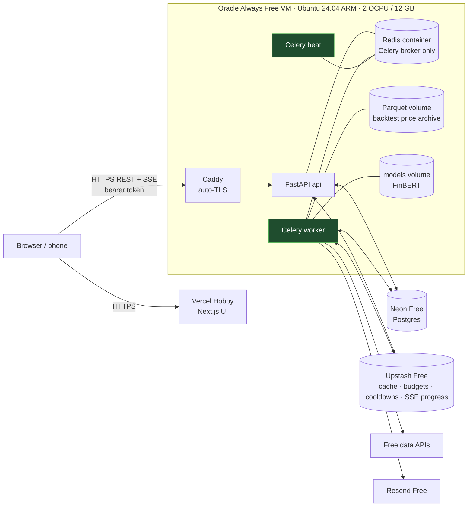

# CatalystEdge: $0 Deployment Guide

**Local Docker first, then Oracle Cloud + Vercel + Neon + Upstash.**

> Written in Phase 0, alongside the code. Free-tier limits verified 2026-09-24 via web
> search (provider sites are blocked from the build sandbox). Re-check anything marked ⚠
> at sign-up.

| Stage | Where it runs | Cost |
|---|---|---|
| **1. Local** (build, test, backtest) | your PC, `docker compose up` | $0 |
| **2. Online** (alerts while your PC is off) | **Oracle Always Free VM**: API + Celery worker + beat + local Redis broker · **Neon**: Postgres · **Upstash**: shared cache / budgets / cooldowns · **Vercel**: Next.js UI | $0 |

The same code and images run in both stages. Only `.env` and the compose file differ:
`docker-compose.yml` for local, `docker-compose.cloud.yml` for Oracle.

---

## 1. Local Docker

### 1.1 Requirements
- Docker Desktop (Windows/macOS) or Docker Engine + Compose plugin (Linux)
- 8 GB RAM (16 GB if you want the optional Ollama LLM), ~6 GB free disk

### 1.2 Run it
```bash
git clone https://github.com/eswarpavan/claude-code.git catalystedge
cd catalystedge
cp .env.example .env            # add the free API keys (ARCHITECTURE.md §14)
docker compose up -d            # FIRST RUN IS SLOW: image builds + ~0.5–1 GB model download
docker compose ps               # wait until every service is "healthy"
```
- UI: http://localhost:3000 · API docs: http://localhost:8000/docs
- **Source Health → Models** shows model download status.
- Stop with `docker compose down`. Data persists in the `pgdata`, `models` and `parquet` volumes.

### 1.3 Useful commands
```bash
make test               # full test suite, including the rule tests
make verify-sources     # calls each API with your keys, records real limits
make backtest           # EDGAR + earnings backtest (Phase 2), writes report to DB
docker compose logs -f worker
```

Locally, scheduled buys and alerts only fire while your PC is on and awake. That is why
stage 2 exists.

---

## 2. Online for $0: Oracle + Vercel + Neon + Upstash

### 2.1 Layout



**Why each piece is where it is**
- **Oracle VM** runs everything that must be always on (worker, beat, API), so alerts and
  paper trades fire while your PC is off.
- **Neon** holds the database *off* the VM, so if Oracle ever reclaims or you rebuild the
  VM, your ledger, signals and outcome history survive.
- **Upstash** holds rate-limit budgets, TTL cache, refresh cooldowns and SSE progress
  messages. These also survive a VM rebuild, so you won't burn free API quotas re-fetching.
- **The Celery broker stays on a local Redis container.** Broker polling would use up
  Upstash's 500k commands/month within days. It holds only transient task messages, so
  losing it is harmless.
- **The backtest price archive is Parquet on the VM's disk** (Oracle gives 200 GB of free
  block storage). Neon's 0.5 GB can't hold years of EOD bars. Only backtest *reports* and
  calibration snapshots go to Neon.
- **Vercel** serves the UI from a CDN, and the browser calls the API directly over HTTPS.

### 2.2 Free-tier limits and how CatalystEdge stays inside them

| Service | Free limit (verified 2026-09-24) | CatalystEdge design choice | Expected usage |
|---|---|---|---|
| **Oracle Always Free** | Ampere A1 **2 OCPU / 12 GB RAM** since 2026-06-15 (was 4/24); 200 GB block storage; idle instances may be reclaimed if 7-day p95 CPU, network **and** memory are all < 20% | no Ollama in cloud profile | ≈ 3 GB RAM |
| **Neon Free** | **0.5 GB** storage/project; **100 CU-hours**/project/month; scale-to-zero after 5 min (always on); 5 GB egress | short-lived DB connections (`NullPool`); cloud schedule polls **every 15 min 06:00–20:00 ET on trading days, hourly otherwise**; 48 h news retention; EOD kept 1 year for ≤ 500 symbols | ≈ **45–60 CU-h** (see 2.6); ≈ 150–300 MB |
| **Upstash Redis** | **500k commands/month**, 256 MB, 10 GB bandwidth | no broker traffic; progress messages only during refreshes | ≈ 50–150k commands |
| **Vercel Hobby** | free, **personal / non-commercial** | static UI, no Vercel functions or cron needed | tiny |
| **Resend** | 3,000 emails/month, 100/day | dedupe + cap of 50/day | tiny |

Source Health shows **live usage against each limit** (Neon storage and CU-hours via the
Neon API, Upstash commands via its API, VM RAM/CPU). It warns at 80%.

### 2.3 Accounts (all free)
1. **Oracle Cloud** (oracle.com/cloud/free): home region in the US (e.g. Ashburn, which is
   close to the data APIs). A card is required for identity; Always Free resources are not
   charged.
2. **Neon** (neon.com): project `catalystedge`, region **AWS us-east-1**, Postgres 16.
3. **Upstash** (upstash.com): Redis database in **us-east-1**, TLS on.
4. **Vercel** (vercel.com): Hobby, sign in with GitHub.
5. **Resend** (resend.com): verify a sender domain, or use their test sender to email only yourself.
6. **DuckDNS** (duckdns.org): free subdomain such as `catalystedge-you.duckdns.org` for the
   VM's HTTPS certificate. No domain purchase needed.
7. The free data-API keys (`ARCHITECTURE.md` §14).

### 2.4 Step by step

**Step 1 · Neon**
Copy two connection strings from the Neon dashboard: the **pooled** one (host contains
`-pooler`) for the app, and the **direct** one for migrations.
```bash
# from your PC, inside the repo:
DATABASE_URL_DIRECT="postgresql://…neon.tech/catalystedge?sslmode=require" \
  docker compose run --rm api alembic upgrade head     # tables + the rule-2 DB trigger
docker compose run --rm api python -m catalystedge.jobs run seed
```
Optional: copy your local history (ledger, outcomes) to Neon:
```bash
docker compose exec postgres pg_dump -Fc -d catalystedge > local.dump
pg_restore --no-owner -d "$DATABASE_URL_DIRECT" local.dump
```

**Step 2 · Upstash.** Copy the `rediss://default:…@….upstash.io:6379` URL into `UPSTASH_REDIS_URL`.

**Step 3 · Oracle VM**
1. Compute → Instances → Create: image **Ubuntu 24.04**, shape **VM.Standard.A1.Flex,
   2 OCPU / 12 GB**, boot volume 100 GB, add your SSH key. If you get "Out of capacity",
   try another availability domain or retry later.
2. Networking: the VCN security list must allow ingress **TCP 80 and 443** only (SSH 22
   restricted to your IP). Ubuntu images on OCI also have iptables rules, so open the ports
   there too:
   ```bash
   sudo iptables -I INPUT 6 -p tcp --dport 80 -j ACCEPT
   sudo iptables -I INPUT 6 -p tcp --dport 443 -j ACCEPT
   sudo netfilter-persistent save
   ```
3. Point DuckDNS at the VM's public IP (`catalystedge-you.duckdns.org` → IP).
4. Install Docker and start CatalystEdge:
   ```bash
   curl -fsSL https://get.docker.com | sh
   sudo usermod -aG docker $USER && newgrp docker
   git clone https://github.com/eswarpavan/claude-code.git catalystedge && cd catalystedge
   cp .env.cloud.example .env     # fill in keys + Neon + Upstash + domain (see 2.5)
   docker compose -f docker-compose.cloud.yml up -d
   docker compose -f docker-compose.cloud.yml ps
   curl https://catalystedge-you.duckdns.org/health
   ```
   All images are multi-arch (arm64 + amd64). Caddy gets a Let's Encrypt certificate automatically.
5. **Avoid idle reclamation.** CatalystEdge is mostly idle between jobs, so CPU p95 will be
   under 20%. Memory (≈ 3 of 12 GB ≈ 25%) is what keeps it above the line, but it is close.
   The reliable fix: upgrade the account to **Pay-As-You-Go**. It stays $0 while you use only
   Always Free resources, and PAYG accounts are not subject to idle reclamation. ⚠ Confirm
   both statements on Oracle's Always Free page when you sign up. Also set a **$1 budget
   alert** in Oracle Billing so any accidental paid resource is caught immediately.

**Step 4 · Vercel**
1. Add New → Project → import the repo, **root directory `frontend`**, framework Next.js.
2. Environment variable: `NEXT_PUBLIC_API_URL=https://catalystedge-you.duckdns.org`.
3. Deploy. Put the resulting URL (e.g. `https://catalystedge-you.vercel.app`) into the
   VM's `.env` as `CORS_ORIGINS`, then `docker compose -f docker-compose.cloud.yml up -d api`.

**Step 5 · Log in and smoke-test**
- Open the Vercel URL and log in with `APP_PASSWORD`. The API issues a bearer token that
  the UI keeps in memory/sessionStorage. SSE uses fetch-streaming with that header, so no
  third-party cookies are needed.
- Cached pages appear instantly. Click **Refresh now**, and per-source rows should go OK
  within a minute.
- `docker compose -f docker-compose.cloud.yml exec worker python -m catalystedge.jobs run eod --dry-run`
  should print the next decision date and zero errors.
- Send yourself a test email from **Settings → Notifications → Send test**.

### 2.5 `.env` for the cloud profile (differences from local)
```bash
CATALYSTEDGE_PROFILE=cloud
PUBLIC_HOSTNAME=catalystedge-you.duckdns.org   # Caddy uses it for TLS
DATABASE_URL=postgresql+psycopg://…-pooler….neon.tech/catalystedge?sslmode=require
DATABASE_URL_DIRECT=postgresql+psycopg://….neon.tech/catalystedge?sslmode=require
DB_POOL=null                                   # short-lived connections so Neon can suspend
UPSTASH_REDIS_URL=rediss://default:…@….upstash.io:6379
CELERY_BROKER_URL=redis://redis:6379/0         # local container, NOT Upstash
CORS_ORIGINS=https://catalystedge-you.vercel.app
APP_PASSWORD=<long random string>
SCHEDULE_PROFILE=neon_friendly                 # 15-min market-hours polling, hourly otherwise
OLLAMA_ENABLED=false
```

### 2.6 Neon compute budget, worked out
Neon bills compute while awake. Each wake lasts the job time plus the 5-minute suspend delay.
At the minimum 0.25 CU:
- Market hours (06:00–20:00 ET, ~22 trading days): a 15-min poll keeps it awake ~6 of every
  15 min, which is 40% × 308 h ≈ 123 h × 0.25 ≈ **31 CU-h**
- Other hours: hourly poll, ~6 of 60 min = 10% × ~410 h ≈ 41 h × 0.25 ≈ **10 CU-h**
- EOD, paper and outcome jobs plus your UI sessions: ≈ **5–15 CU-h**
- **Total ≈ 45–60 CU-h of 100.** A 5-minute poll during market hours would keep Neon awake
  continuously and push it over, so the cloud profile defaults to 15 min. This barely
  matters under rule 2 (EOD decisions only). It mainly affects how fast 80%+ alert emails
  arrive.

If Neon usage passes 80%, the worker automatically stretches polling to 30 min and
Source Health says so.

### 2.7 Backups ($0)
- Neon keeps a short point-in-time restore window on the Free plan. For your own copy,
  a nightly `pg_dump` runs on the VM (`infra/backup.sh`) into the Parquet volume, keeping 14 days.
- Every few weeks, pull a copy to your PC:
  `scp ubuntu@<vm>:~/catalystedge/backups/latest.dump .`

### 2.8 Updating
```bash
ssh ubuntu@<vm> 'cd catalystedge && git pull && \
  docker compose -f docker-compose.cloud.yml run --rm api alembic upgrade head && \
  docker compose -f docker-compose.cloud.yml up -d --build'
```
Vercel redeploys the UI automatically on every push to the default branch.

### 2.9 Security checklist
- Only ports 80/443 open to the world, and SSH restricted to your IP.
- `APP_PASSWORD` protects every API route except `/health`. The API rate-limits login attempts.
- All secrets live in the VM's `.env` (mode `600`) and in Vercel env vars. Nothing is committed.
- Vercel Hobby and Finnhub free are **non-commercial**. Keep this personal.

### 2.10 Known risks and what happens
| Risk | Effect | Mitigation built in |
|---|---|---|
| Oracle reclaims or stops the VM | jobs stop; data safe in Neon/Upstash | PAYG upgrade; health-check email from Resend if no heartbeat for 2 h (sent by the worker's watchdog; see note) |
| Neon over 100 CU-h | DB suspended until month end | auto-stretch polling at 80%; usage on Source Health |
| Free-tier terms change | a source or service stops | per-source circuit breakers; Source Health; this doc lists each fallback |
| VM down over a market open | pending paper orders **cancelled** (`missed_session`), never filled at a stale price | idempotent jobs catch up the rest on restart |

Note: a watchdog running *on* the VM can't report its own death. The UI shows "worker last
seen" from Upstash. For an external alarm at $0, add a free uptime monitor (e.g. UptimeRobot's
free plan ⚠) pointed at `/health`.

---

## Why not Railway or GitHub Actions for the worker?
- **Railway**'s Free plan is **$1 of credit/month** after a one-time $5 trial. An always-on
  worker holding FinBERT (~1–1.5 GB at $10/GB-month) would cost ~$10–20/month.
- **GitHub Actions** cron works ($0, 2,000 min/month on private repos), but it forces
  30-minute polling and delayed starts. The Oracle VM does everything it does, better.

*Not financial advice.*
